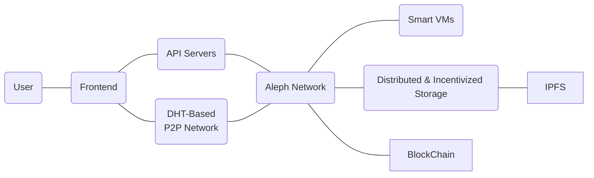

# Aleph Architecture

In current solutions involving smart contracts, the current state of applications is written (or computed from) on a blockchain, this is immutability. But what if you want instantaneous actions, batching user requests for non critical items?

You'll need a second layer of truth, a distributed state that you can influence by signing messages.

Agents will then commit the messages on the blockchain for the users, incentivized by the network token. They will spend the native chain asset and will receive the token in exchange for their service, provided by the next authorized agent. Then that agents work will be verified by the previous agent, changing it's credit score on the fly.

This allows for free and instant interaction with dapps for users, with efficient batched inserts on the blockchain for immutability.

Moreover, this more easily facilitates agents running API servers that can be used by the dapps as entry points to the network.

Below are a few focal actions of the Aleph network:

- Instant (low-latency) global status update
- Bulk content write on blockchain to allow fee-less commits
- Pinning IPFS data (data replication)
- API server decentralization
- Virtual machines code execution and verification



## Blockchains used by Aleph

The first underlying blockchain supported by Aleph is NULS. 
To allow easier port of existing dapps and ecosystems, later in the developement process, other blockchains can be supported such as Ethereum, NEO and even the Bitcoin blockchain.

The address in the Aleph network is the underlying network of choice (NULS, Ethereum, NEO...) address used to sign messages. A user can post in his personal aggregate (key-value hash table linked to his primary address) his addresses on other networks. That way he can redeem or receive tokens from other blockchains.

If a user has a NULS account and an Ethereum account both linked together, a request for his aggregates (profile or settings for example), posts (images, blog posts...), or any other linked content will return the same information from any of the two addresses.

## Data storage

The hashes of the data are stored on chain. The data itself is stored encrypted or not on IPFS. Data is pinned by participating nodes.

Posting is done either via API by the dapps to an API node, or by IPFS directly if available on the browser.

The current state is stored on both blockchain (nodes are made of a blockchain explorer) and current received data that is not posted yet (queue, mempool).

Once the data signature is verified, and it is broadcasted to at least 2 nodes, it is considered validated and included in the coming blocks.

```{.mermaid caption="Data posting procedure"}
graph LR
    linkStyle default interpolate basis
    US(User) --> B[Publishes new content with no fee]
    B --> AL(Aleph Network)
    AL --Updates--> ST[State]
    ST --> US
    AL --> D[Adds to a block, pays fee]
    AL --> STO[Ensures content storage]
    STO --> US
    D --> NU(NULS)
    D -.-> ET(Ethereum)
    NU --> ST
    ET -.-> ST
``` 

## Data type

----------------------------------------------------------------------------------------------------------------------------------
Data Type      Description               Details
-------------- ------------------------- -----------------------------------------------------------------------------------------
**Aggregates** Key-value store linked    Each key can be updated separately and its content is merged with previous.
               to an account[^3]             *Example*: user profile

**Posts**      Single data entry         Has a type field, an optional ref (reference) field that references another
                                         post or application-specific string.
                                         Can be amended with new posts with type "amend" and ref to the previous post.
                                         Data inside post content can be optionally encrypted with either owner key or a recipient key.
                                         *Example:* blog post, comment, picture gallery, video entry, new data point, new event...

**VM State**   State of a virtual        Fields depending on underlying engine
               machine                   (dockerized language-specific contracts or WASM for example)
----------------------------------------------------------------------------------------------------------------------------------

Table: Data types

## Data exchange

The exchange of data between the dapps and the nodes is done either by pubsub (if available) or API posting. The node will do the pubsub action on behalf of the user.

Using pubsub, all nodes will get the user posts and actions.

Pubsub is using dht and ensuring all subscribed nodes will receive all users posts to get the current state.

```{.mermaid caption="Data posting procedure"}
graph LR
    linkStyle default interpolate basis
    A(New content on client) --> B[New IPFS Hash]
    B --> C[IPFS Hash signed]
    C --> D{Client supports direct p2p}
    D -- Yes --> E1[Posts via pubsub]
    D -- No --> E2[Posts via API]
    E2 --> E3[API Server posts via pubsub]
    E3 --> F[Signature verification]
    E1 --> F
    F --> E(Nodes add post to queue)
```

## State

State encompasses both onchain committed data and uncommitted data received by pubsub. State can be recomputed by getting all TX from a user or containing messages signed by him, and adding the uncommitted messages.

- For smart contracts/VMs, it should be recomputed from last committed, signed and non revoked (no litigation) onchain state.
- For aggregates (user hash tables) from the last onchain commit for each key.
- For posts, from the original post plus all the amends. If last amend contains all the fields, original plus last amend is acceptable.
 
```{.mermaid caption="State composition"}
graph LR
    linkStyle default interpolate basis
    A(Objects stored on chain) --1st--> C
    B(Objects in the queue) --2nd--> C
    C(State stack) --> D[Compute state with amends and layers]
    D --> E(Current state)
```

## Virtual machines

Sometimes called smart contracts, the virtual machines have a state that is commited as an object in the chain.
All nodes don't need to keep all the VM's states, only the last one if no litigation occurred.

### Hash links

Each mutation to a VM state contains a relation to a previous state (previous hash). If two data blocks relate to the same hash, the first to be commited on-chain will prevail (in case of data sync), and the first to be received (in case of off-chain processing before block inclusion).

In the event a new block is posted with a different history than what is computed off-chain, two possibilities occurr:

- On-chain content is deemed bad (according to specific rules) and discarded in a new commited transaction, off chain content taking its place
- Off-chain content is discarded and clients are notified

### VM State content

The VM state object is specific to the engine used (WASM, docker-like language specific VM, JVM...), but typically contains:

- Relation to the previous state (object chain using hashes)
- Function called
- Arguments
- Function result
- New serialized state (can be a diff only for big states, in special cases)

### Concurrency

While view-only functions that don't modify the state can be done concurrently, the write functions can't happen concurrently (or will end up in a fork). 
A node can send a pubsub message to broadcast it is working on/executing a "write"  function on a specific VM. Once that has been completed, it will broadcast the new state to the other nodes in the same pubsub channel, thus enabling them to execute a write function from this point in history.

## Cross-application data exchange and data ownership

All applications in the Aleph ecosystem are talking to the same data storage entity.
Conventions exist and have to be documented on data structures to be used by applications.

This enables applications to use the same user profiles (example nuls.space and nuls.world/social using the same profiles, and nuls.world/apps/vote using the profile and same post format than the formers for its content) and content sources if needed.
A new developer can come and make a new frontend to all the existing data posted by users. Users own their data.

## Moderation and requests for removal

### Network and data moderation

Each application can have its own storage of black-listed content and addresses to handle its own moderation features (the application will then omit certain content or content creators from the user interface).

For illegal content, the network will also have its own storage that will be synchronised between nodes of blacklisted content and addresses. Linked content hashes will be automatically unpinned from all nodes, leading to its destruction from the Aleph network.

### Removal request

To comply with regulations (GPDR in particular), in a similar fashion to the illegal content data unpinning, a user can request certain hashes he posted to be removed, or even his full address data to be put into blacklist by signing a message using his public key.

## Nodes

### Clients

Simple clients to the network are either using the API to API node or p2p pubsub connection to the network. If they are using the p2p system then they can act like a full node and validate messages themselves (and run VM themselves if it's available for their platform, WASM working in web browsers).

They should be careful to verify the signatures of the received messages and states if they don't trust the API server or if they are connected directly to the network.

### Packing nodes

The Packing nodes are those which validate the messages and submit their hashes to the underlying blockchains. They get rewarded for their action (token reward) or punished if they don't do their duty correctly.

If a packing node is found committing nefarious acts by the consensus, its address is blacklisted and his rewards (and/or deposit, this is to be defined, see Roadmap chapter) frozen.

Those nodes must be both API nodes and storage nodes too.

### Storage nodes

The storage nodes pin incoming IPFS hashes to ensure distributed (geographically and accross multiple hosts to ensure the data won't go away) storage of the content. 

Those nodes must be API nodes and may optionally be packing nodes too.

They are rewarded in tokens for their duty.

[^3]: Underlying blockchain of choice address and linked public key.

### Full Node

Packing and storage nodes are using this codebase, activating some modules and configuration to do their work.

The APIs are a module that can be activated (mandatory one for incentivized nodes).

Features of an Aleph Node:

- Indexes the underlying blockchain it is configured for (can be more than 1)
- Has an IPFS client built-in
- Keeps track of modifications to the chain (forks, history rewrite...)
- Connected to pubsub channels to update its off chain state
- Retrieves IPFS content (from storage nodes or sender) commited onchain or recieved in pubsub to review and index content (and pins it if needed)
- Executes VMs code (if configured for it, and only relevant ones)

#### Indexing

Depending on the underlying chain volume, a full index will be done, or only an index based on specific events (triggered by a smart contract for example -on Ethereum-, a tx type -business data on NULS- or op_return & similar).

For maximum security, the incentivized Aleph nodes in charge of sensitive parts of the network will connect to a local node of this blockchain (to detect forks for example), simpler nodes can connect to explorers or public api servers of those chains to act as light wallets.

