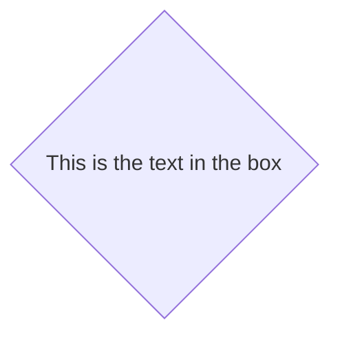

# Aleph Architecture

In the current solutions involving smart contracts, the current state of applications is written (or computed from) a blockchain, this is immutability. But what if you want instant actions, batching user requests for non critical things?

You'll need a second layer of truth, a distributed state that you can influence by signing messages.

Agents will then commit the messages on the blockchain for the users, incentivized by the network token. They will spend the native chain asset, and will receive the token in exchange for their service, given by the next authorized agent, who will verify that the work has been well done by the previous agent, changing it's credit score on the fly.

This allows for free and instant interaction with dapps for users, with efficient batched insert on the blockchain for immutability.

Moreover, agents are running API servers that can be used by the dapps as entry points to the network.

## Blockchains used by Aleph

The first underlying blockchain supported by Aleph is NULS. Later in the developement process, other blockchains can be supported like Ethereum, NEO and even the Bitcoin blockchain.

## Data storage

The hashes of the data are stored on chain, the data itself is stored encrypted or not on IPFS. Data is pinned by participating nodes.

Posting is done either via API by the dapps to an API node, or by IPFS directly if available on the browser.

Current state is stored on both blockchain (nodes are made of a blockchain explorer) and current received data that is not posted yet (queue, mempool).

Once the data signature is verified, and it is broadcasted to at least 2 nodes it is considered validated, and it will be included in the coming blocks.

## Data type

----------------------------------------------------------------------------------------------------------------------------------
Data Type      Description               Details
-------------- ------------------------- -----------------------------------------------------------------------------------------
**Aggregates** Key-value store linked    Each key can be updated separately, and its content is merged with previous.
               to an account[^3]             *Example*: user profile

**Posts**      Single data entry         Has a type field, an optional ref (reference) field that references another
                                         post or application-specific string.
                                         Can be amended with new posts with type "amend" and ref to the previous post
                                         *Example:* blog post, comment, picture gallery, video entry, new data point, new event...

**VM State**   State of a virtual        Fields depending on underlying engine
               machine                   (dockerized language-specific contracts or WASM for example)
----------------------------------------------------------------------------------------------------------------------------------

Table: Data types

## Data exchange

The exchange of data between the dapps and the nodes is done either by pubsub (if available) or API posting, and the node will do the pubsub action on behalf of the user.

Using pubsub all nodes will get the user posts and actions.

Pubsub is using dht and ensuring all subscribed nodes will receive all users posts to get the current state.

## State

State encompasses both onchain committed data and uncommitted data received by pubsub. State can be recomputed by getting all TX from a user or containing messages signed by him, and adding the uncommitted messages.

- For smart contracts/VMs, it should be recomputed from last committed, signed and non revoked (no litigation) onchain state.
- For aggregates (user hash tables) from the last onchain commit for each key.
- For posts, from the original post plus all the amends. If last amend contains all the fields, original plus last amend is acceptable.

[^3]: Underlying blockchain of choice address and linked public key.

